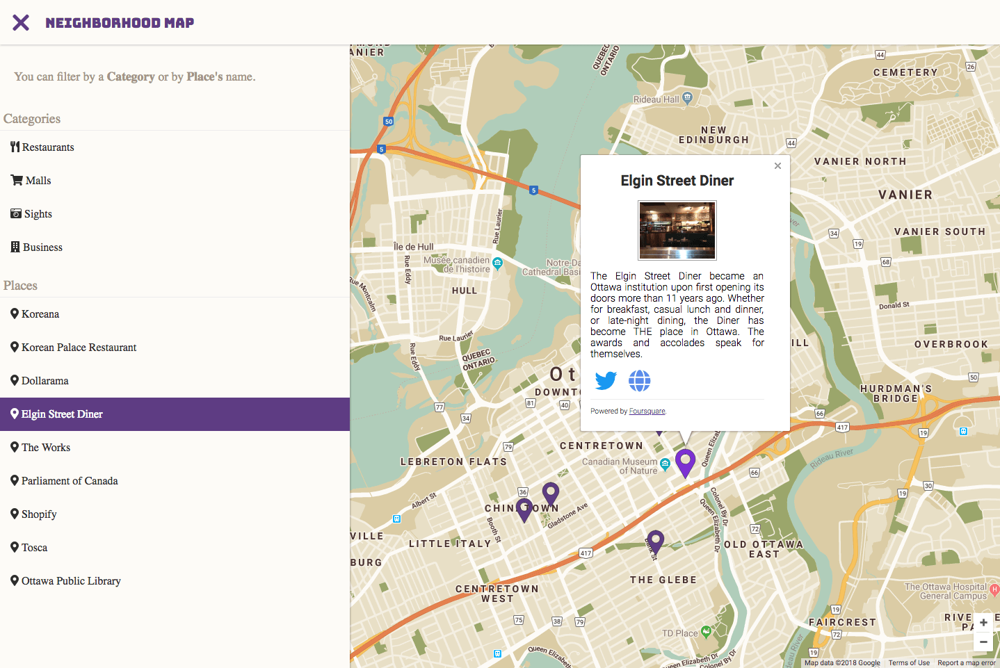

# Neighborhood Map

- [About this project](#about)
- [Features](#features)
- [Requirements](#requirements)
- [Usage](#usage)
- [Important Notes about uses of third-party libraries, scripts and tutorials](#important-notes)
- [License](#license)

<a name="about"></a>

## About
This project shows a map of a neighborhood and its sights that I want to visit. The main goal is build a mashup of google maps and other services, providing a useful map and information about the place.

<a name="features"></a>
## Features
- [x] Google Maps
- [x] React

<a name="requirements"></a>
## Requirements
- Yarn
- NPM
- NodeJS

<a name="usage"></a>
## Usage

Start cloning the repository.
```bash
git clone https://github.com/klassmann/udacity-neighborhood-map.git
```

Inside the project folder, install the dependencies with `npm`.
```bash
npm install
```

Start the local server, It will open the browser automatically.
```bash
yarn start
```

<a name="important-notes"></a>
## Important Notes about uses of third-party libraries, scripts and tutorials

For helping me to integrate React with a Google Maps, I have been following some instructions and tips from this Blog post:
  - [How to Write a Google Maps React Component](https://www.fullstackreact.com/articles/how-to-write-a-google-maps-react-component/)

I used some scripts from the tutorial, I copy them from this [Gist](https://gist.github.com/auser/1d55aa3897f15d17caf21dc39b85b663):
  - [GoogleAPI.js](https://gist.github.com/auser/1d55aa3897f15d17caf21dc39b85b663#file-googleapi-js)
  - [GoogleAPIComponent.js](https://gist.github.com/auser/1d55aa3897f15d17caf21dc39b85b663#file-googleapicomponent-js)
  - [ScriptCache.js](https://gist.github.com/auser/1d55aa3897f15d17caf21dc39b85b663#file-scriptcache-js)

There is a complete project on [Github](https://github.com/fullstackreact/google-maps-react), but I am using only the basic scripts. There are other components that a write following the instructions from the tutorial, I change for my purposes.

I used this scripts and references because I am not advanced in *React* and I needed to follow some instructions to help me to understand how to load the *Google API* and *React* and how to use third-party components with *React*.

<a name="license"></a>
## License
You can't use this project as your project for Udacity, but you can use for study purposes if you want.
